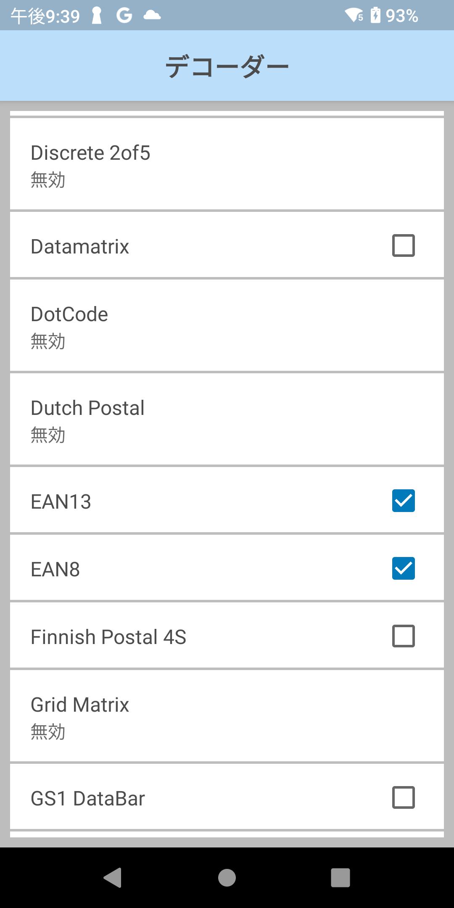

## Zebra DataWedgeの基本設定 (初めての方向け）

---

 

### DataWedgeとは？

DataWedgeはZebraのAndroidデバイスに搭載されているアプリケーションサービスで、スキャナやRFIDを含む入力データを効率的にアプリケーションと連携するためのものとなります。

DataWedgeを使用することで、スキャナなどからのデータ入力に関するコーディングを大幅に削減することができるようになります。

このサービスは、バーコードスキャナ、マグストライプリーダー（MSR）、RFID、音声入力、シリアルポートなど、複数の入力ソースからデータを取得し、必要に応じてそのデータをフォーマットすることができます。

本頁ではDataWedgeの基本的な機能について説明をします。

 

##### 参考リンク

[DataWedge 11.3 - 概要](https://techdocs.zebra.com/datawedge/dw-jp/11-3/guide/about/)

---

### 特定のアプリ向けのDataWedgeプロファイルを作成する方法

スキャンデータなどの入力データをアプリケーション毎に設定をしたいケースがあります。

#### 例、

- アプリAではスキャン後にエンターキーを付与したい
- アプリBではスキャン後にタブキーを付与したい

このような要望に答えるため、アプリケーション毎に専用設定（プロファイル）を作成する機能がDataWedgeにはあります。

プロファイルの詳細や作成方法は下記リンクを参照ください。

 

##### 参考リンク

[サードパーティ アプリケーション用の DataWedge プロファイルの作成](https://supportcommunity.zebra.com/s/article/Creating-a-DataWedge-profile-for-a-third-party-application?language=ja)

---

### 読み取り対象のバーコードを設定

DataWedgeにおいてはスキャン対象のバーコードタイプを取捨選択することができます。読み取り範囲に多くのバーコードが密集しており、特定タイプのバーコードのみを選択したい場合などに活用される設定項目となります。

 

#### 設定方法

1. DataWedgeを起動 > [設定対象のプロファイル] を選択します。
2. "バーコード入力"カテゴリ >  スキャナ設定 >  デコーダー
3. スキャン対象のバーコードタイプのみ選択された状態とします。
 

設定例：EAN13 (JANコード/13,8桁)の選択

">

 

1. 上記設定により、選択したバーコードタイプのスキャンデータのみ読み取るようになります。
 

スキャン例：

 

##### 参考リンク

[DataWedge 11.0 - デコーダ](https://techdocs.zebra.com/datawedge/dw-jp/11-0/guide/decoders/)

---

### スキャンデータの前後にデータを付与する設定

DataWedgeにおいてはスキャンデータの前後に任意のデータを付与することができます。一般的には下記のような用途でよく用いられます。

- スキャンデータの後にエンターキー(CRLF)を付与
- スキャンデータの後にタブキー(TAB)を付与

下記の説明ではスキャンデータの後にエンターキーを付与する設定について説明をします。

#### 設定方法

1. DataWedgeを起動 > [設定対象のプロファイル] を選択します。
2. "キーストローク"カテゴリ >  基本データフォーマット
3. "Enter キー送信"を選択します。
 

設定例：エンターキーを付与

 

1. テキストエディタ等でスキャン後にEnterキーが追加されていることが確認できます。

4901085647202をスキャンした例：

 

##### 参考リンク

[DataWedge 11.0 - 基本データ形式](https://techdocs.zebra.com/datawedge/dw-jp/11-0/guide/process/bdf/)

---

#### より高度なデータ付与設定方法

スキャンデータにより高度なプリフィックスやサフィックスを追加したい場合は下記に従って設定をお願いいたします。

1. DataWedgeを起動 > [設定対象のプロファイル] を選択します。
2. "キーストローク"カテゴリ >  高度なデータフォーマット（ADF）

 

##### 参考リンク

[DataWedge 11.0 - ADF](https://techdocs.zebra.com/datawedge/dw-jp/11-0/guide/process/adf/)

---

### Data Caputure Plusの設定

**Data Capture Plus (DCP)**はDataWedgeの機能の一つで、モバイルデバイスの画面上にスキャントリガーを表示できる機能です。DCPを使用することで、ユーザーは画面の特定の領域をタップすることでデータキャプチャを開始できます。これは、物理的なスキャナーボタンを押すのと同様の動作を実現します。物理的なスキャナーボタンを押さずに画面内の操作でスキャンをしたい場合に重宝する機能です。

 

 

 

1. DataWedgeを起動 > [設定対象のプロファイル] を選択します。
2. "データキャプチャプラス"カテゴリ >  "データキャプチャプラスを有効化" にチェックを入れます。
3. 下記設定項目を参考にスキャンボタンの詳細設定をします。

 

| 設定項目            | 説明                                                                                                 |
| ------------------- | ---------------------------------------------------------------------------------------------------- |
| ボタンの位置        | ボタンの位置の設定 ・左 ・右 ・右または左                                             |
| 開始モード設定      | DCP を起動するモードの設定 ・ボタンのみ ・全画面のみ ・ボタンによる全画面への切り替え |
| ボタン最高/最低位置 | ボタン最高/最低位置の設定                                                                            |
| ドラッグ検出時間    | 画面をタップした後にスキャナ アクションをトリガするまでの待機時間の設定                              |

 

---

### トリガーモード設定

 

バーコードをスキャンするタイミングは業務によって様々です。１つ１つ確実に読み取りをするピッキングのような業務もあれば、連続して大量の読み取りをする入庫タスクもあります。最も効率の良いスキャン業務をサポートするため、DataWedgeにはスキャントリガー押下時のスキャン処理方法を設定することができます。

 

1. DataWedgeを起動 > [設定対象のプロファイル] を選択します。
2. "バーコード入力"カテゴリ >  スキャナ設定 > リーダーパラメーター > 照準タイプ
1. 良く利用される設定項目は下記を参照。

 

|設定項目| 機能 | 処理終了条件 |
|-|-|-|
|トリガ            |トリガー押下時にスキャン開始。| スキャン成功時 or トリガーをリリース時。
|押してリリース     |トリガー押下時とリリース時にスキャンを開始| スキャン成功時 or 設定時間に到達した場合。
|プレゼンテーション |常時読み取りモード。| - 
|連続読み取り       |トリガー押下中に連続スキャン。| トリガーをリリース時。
|押して待機         |トリガー押下後に任意の時間だけ読み取りを継続| スキャン成功時 or 設定時間に到達した場合。
|押して継続         |トリガー押下後に任意の設定時間だけ連続読み取りを継続。| 設定時間に到達した場合。
|Timed Continuous   |トリガー押下後に任意の設定時間内に読み取りがあると、設定時間を0に戻し、スキャン処理を継続。|設定時間中にバーコードスキャンがなかった場合。|

 

---

### その他の設定について

上記記載以外にもDataWedgeでは多くの設定ができます。より高度なデータ加工方法についてはTechDocsを参照いただけますと幸いです。

 

##### 参考リンク

[DataWedge 11.3 - 概要](https://techdocs.zebra.com/datawedge/dw-jp/11-3/guide/about/)
